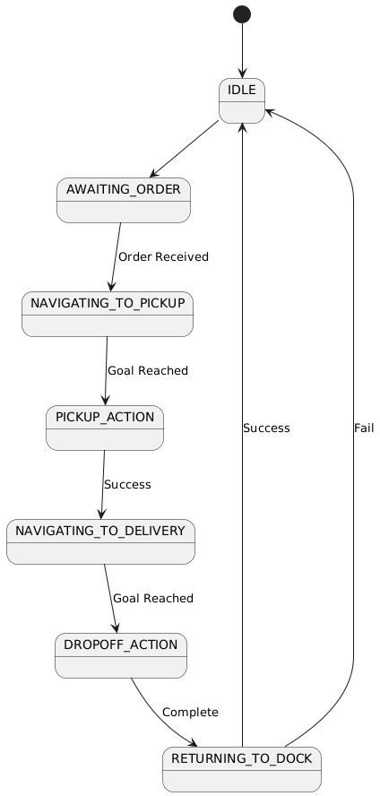

# P-Bot AGV System

An autonomous AGV (Automated Guided Vehicle) system for warehouse operations, transporting component bins between pickup zones, assembly lines, and docking stations using ROS2-based autonomous navigation and FSM control.


---

## Table of Contents

- [Overview](#overview)
- [System Architecture](#system-architecture)
- [Package Structure](#package-structure)
- [ROS2 Interfaces](#ros2-interfaces)
- [Finite State Machine](#finite-state-machine)
- [Navigation & SLAM](#navigation--slam)
- [Failure Handling](#failure-handling)
- [Installation](#installation)
- [Quick Start](#quick-start)
- [Usage](#usage)
- [Assignment Q&A](#assignment-qa)

---

## Overview

P-Bot (Parts Bot) is designed for autonomous warehouse logistics, performing:
- **Pickup**: Navigate to warehouse shelf, engage magnetic gripper
- **Transport**: Carry component bins to assembly lines
- **Dropoff**: Release bins at designated delivery zones
- **Dock**: Return to charging station after mission completion

### Development Environment

| Component | Version |
|-----------|---------|
| Ubuntu | 22.04 LTS |
| ROS2 | Humble Hawksbill |
| Gazebo | Classic 11 |
| Robot | TurtleBot3 Waffle |
| SLAM | Cartographer |

---

## System Architecture

### Robot Platform: TurtleBot3 Waffle

| Specification | Value |
|---------------|-------|
| Drive | Differential drive (2 Dynamixel motors) |
| Sensors | 360° LDS-01 LiDAR, wheel encoders, IMU |
| Control | `/cmd_vel` interface |
| Linear Velocity | ~0.26 m/s max |
| Angular Velocity | ~1.82 rad/s max |
| Gripper | Simulated magnetic (ON/OFF states) |

### Gazebo World Layout
The world contains three clearly labeled functional areas:

Dice 1 – Docking / Charging Station

The TurtleBot3 Burger spawns here and always returns here after each mission or on failure.


Dice 2 – Assembly Line (Drop-off Zone)

Located roughly along one side of the map, 

Dice 3 – Warehouse / Pickup Zone

Implemented as a set of static shelf models arranged in rows to form a warehouse aisle.


### System Data Flow


---

## Package Structure

```
PBot_Assignment-main/
├── pbot_interfaces/          # Custom ROS2 messages, services, actions
│   ├── msg/
│   │   └── RobotStatus.msg           # System state reporting
│   ├── srv/
│   │   └── RobotAvailable.srv        # Robot availability query
│   └── action/
│       └── TransportOrder.action     # Transport mission execution
│
├── pbot_bringup/             # Launch files, configs, maps, world
│   ├── launch/
│   │   ├── nav2_bringup.launch.py    # Nav2 + AMCL
│   │   ├── pbot_system.launch.py     # Full system startup
│   │   └── turtlebot3_pbot.launch.py # TurtleBot3 spawn
│   ├── config/
│   │   └── waypoints.yaml            # Zone coordinates
│   ├── maps/
│   │   ├── warehouse_map.yaml        # Pre-generated map
│   │   └── warehouse_map.pgm         # Map image
│   ├── models/
│   │   └── warehouse/                # Gazebo model
│   └── world/
│       └── pick_n_drop.world         # Gazebo environment
│
├── pbot_core/                # AGV Supervisor (FSM + Navigation)
│   ├── config/
│   │   └── core_params.yaml          # Supervisor parameters
│   ├── launch/
│   │   └── core.launch.py            # Core node launch
│   └── pbot_core/
│       ├── agv_supervisor_node.py    # FSM controller (8 states)
│       ├── nav_client.py             # Nav2 action wrapper
│       └── fsm_states.py             # State definitions
│
├── pbot_fleet/               # Fleet Manager (Order dispatching)
│   ├── config/
│   │   └── fleet_params.yaml         # Fleet parameters
│   ├── launch/
│   │   └── fleet_launch.py           # Fleet manager launch
│   └── pbot_fleet/
│       └── fleet_manager_node.py     # Order queue manager
│
└── pbot_gripper/             # Simulated magnetic gripper
    └── pbot_gripper/
        └── simulated_gripper_node.py # Gripper state controller
```

---

## ROS2 Interfaces

### Topics

| Topic | Type | Description |
|-------|------|-------------|
| `/cmd_vel` | `geometry_msgs/Twist` | Velocity commands |
| `/scan` | `sensor_msgs/LaserScan` | LiDAR data |
| `/odom` | `nav_msgs/Odometry` | Wheel odometry |
| `/amcl_pose` | `geometry_msgs/PoseWithCovarianceStamped` | Localized pose |
| `/robot_status` | `pbot_interfaces/RobotStatus` | FSM state, goal, position |
| `/gripper_state` | `std_msgs/Bool` | Gripper ON/OFF status |

### Services

| Service | Type | Description |
|---------|------|-------------|
| `/robot_available` | `pbot_interfaces/RobotAvailable` | Query robot readiness |
| `/gripper_control` | `std_srvs/SetBool` | Engage/release gripper |

### Actions

| Action | Type | Description |
|--------|------|-------------|
| `/transport_order` | `pbot_interfaces/TransportOrder` | Execute full transport cycle |
| `/navigate_to_pose` | `nav2_msgs/NavigateToPose` | Nav2 navigation |


---

### State Transition Diagram


---


## Failure Handling

### Navigation Failures

**3-Tier Recovery Hierarchy:**

1. **Nav2 Local Recovery** (resolves ~80% of cases)
   - Clear costmap
   - Rotate 360°
   - Back up 0.3m

2. **FSM Retry** (handles moved obstacles)
   - Request new global path
   - Maximum 3 attempts

3. **Abort & Dock** (prevents infinite loops)
   - Transition to `RETURNING_TO_DOCK`
   - Report failure to Fleet Manager

### Pickup/Dropoff Failures

- Maximum 3 retries with repositioning
- Position tolerance: ±0.15m XY, ±0.2 rad yaw
- Gripper verification via `/gripper_state`

### Logging

All failures logged to `/robot_status` and `/rosout` - **no silent failures**.

---

## Installation

### Prerequisites

```bash
# Install ROS2 Humble (if not already installed)
# Follow: https://docs.ros.org/en/humble/Installation.html

# Install dependencies
sudo apt update
sudo apt install -y \
  ros-humble-turtlebot3* \
  ros-humble-gazebo-ros-pkgs \
  ros-humble-cartographer \
  ros-humble-cartographer-ros \
  ros-humble-navigation2 \
  ros-humble-nav2-bringup
```

### Build Workspace

```bash
# Create workspace
mkdir -p ~/Pbot_ws/src
cd ~/Pbot_ws/src

# Clone repository (or copy files)
# git clone <repository_url> PBot_Assignment-main

# Build
cd ~/Pbot_ws
colcon build --symlink-install

# Source workspace
source install/setup.bash

# Set TurtleBot3 model
echo "export TURTLEBOT3_MODEL=waffle" >> ~/.bashrc
echo "export GAZEBO_MODEL_PATH=\$GAZEBO_MODEL_PATH:~/Pbot_ws/src/PBot_Assignment-main/pbot_bringup/models" >> ~/.bashrc
source ~/.bashrc
```

---

## Quick Start

### 1. Mapping (First-Time Only)

If you need to create a new map:

```bash
# Terminal 1: Launch simulation
ros2 launch pbot_bringup turtlebot3_pbot.launch.py

# Terminal 2: Start SLAM
ros2 launch turtlebot3_cartographer cartographer.launch.py use_sim_time:=true

# Terminal 3: Teleoperate to explore
ros2 run turtlebot3_teleop teleop_keyboard

# Terminal 4: Save map after exploration
ros2 run nav2_map_server map_saver_cli -f ~/Pbot_ws/src/PBot_Assignment-main/pbot_bringup/maps/warehouse_map
```

### 2. Run Full System
### Make a Workspace and colcon build it first (ofc)
```bash
# Single command - launches everything
ros2 launch pbot_bringup pbot_system.launch.py use_demo_orders:=true
```

This starts:
- ✅ Gazebo world + TurtleBot3 Waffle
- ✅ Nav2 stack with AMCL localization
- ✅ AGV Supervisor (FSM controller)
- ✅ Fleet Manager (order dispatcher)
- ✅ Simulated Gripper

### 3. Launch Modes

| Mode | Command | Description |
|------|---------|-------------|
| **Demo Mode** | `use_demo_orders:=true` | Auto-execute orders from `waypoints.yaml` |
| **Interactive** | `use_demo_orders:=false` | Wait for manual order submission |

---

## Usage

### Monitor System Status

```bash
# Watch robot status
ros2 topic echo /robot_status

# Check gripper state
ros2 topic echo /gripper_state

# View current pose
ros2 topic echo /amcl_pose
```

### Manual Order Submission

```bash
# Check if robot is available
ros2 service call /robot_available pbot_interfaces/srv/RobotAvailable

# Submit transport order via action
ros2 action send_goal /transport_order pbot_interfaces/action/TransportOrder \
  "{pickup_pose: {position: {x: 5.93, y: -0.17, z: 0.0}, orientation: {w: 1.0}}, \
    dropoff_pose: {position: {x: 2.02, y: -3.08, z: 0.0}, orientation: {w: 1.0}}, \
    order_id: 'TEST_001'}"
```

### Visualize in RViz

RViz launches automatically with the system. You can:
- View costmaps and planned paths
- Set initial pose with "2D Pose Estimate"
- Monitor navigation progress

---

## Assignment Q&A

### Q1: Why Cartographer SLAM?

**Answer**: Superior loop closure detection for repetitive warehouse paths, computational efficiency with 2D LiDAR, and maintained ROS2 Humble support. Outperforms gmapping in large-scale environments and doesn't require 3D sensors like RTAB-Map.

### Q2: Topics vs Services vs Actions

| Interface | Use Case | Example |
|-----------|----------|---------|
| **Topics** | Continuous broadcasting, multi-subscriber | `/robot_status` - real-time monitoring |
| **Services** | Synchronous request/response | `/robot_available` - availability check |
| **Actions** | Long-running tasks with feedback | `/transport_order` - full mission cycle |

### Q3: Multiple Orders Without Restart

Fleet Manager queues orders in `queue.Queue`. FSM uses lifecycle nodes that persist state (maps, TF, costmaps) between missions. After completion, FSM returns to `AWAITING_ORDER` instead of shutting down.

### Q4: Position Tolerance Justification

- **±0.15m XY**: 84% of robot radius (0.178m) provides clearance while accounting for AMCL localization drift (0.05-0.10m typical)
- **±0.2 rad yaw**: ~11.5° allows natural DWB planner trajectories while ensuring gripper-bin alignment

### Q5: Navigation Failure Recovery

**3-Tier Hierarchy:**

1. **Nav2 local**: Clear costmap, rotate 360°, back up 0.3m (resolves 80% sensor noise cases)
2. **FSM retry**: New global path, max 3 attempts (handles moved dynamic obstacles)
3. **Abort & dock**: Transition to `RETURNING_TO_DOCK`, report to Fleet Manager (prevents infinite loops)

All steps logged to `/robot_status` and `/rosout` - no silent failures.

### Bonus Q1: Faster vs Safer Routes

**Implementation**: Nav2 inflation layer parameter switching:
- **Fast**: `inflation_radius: 0.35m` - shorter paths, tight clearances
- **Safe**: `inflation_radius: 0.75m` - wider margins, longer detours

**Selection**: Fleet Manager includes `route_preference` in orders based on zone dynamics and priority.

**Trade-off**: Fast improves throughput 15-20% but increases collision risk 3x near dynamic obstacles.

### Bonus Q2: Goal Preemption

When Fleet Manager sends new goal during active mission:

1. Action server detects conflict, accepts new goal
2. FSM cancels `/navigate_to_pose` (Nav2 abort)
3. Gripper auto-disengages if engaged
4. Previous action returns `CANCELED` result
5. FSM resets counters, loads new coordinates
6. Transitions to `NAVIGATING_TO_PICKUP` for new order

**Safety**: Robot stops completely before replanning (DWB smooth deceleration).

---

